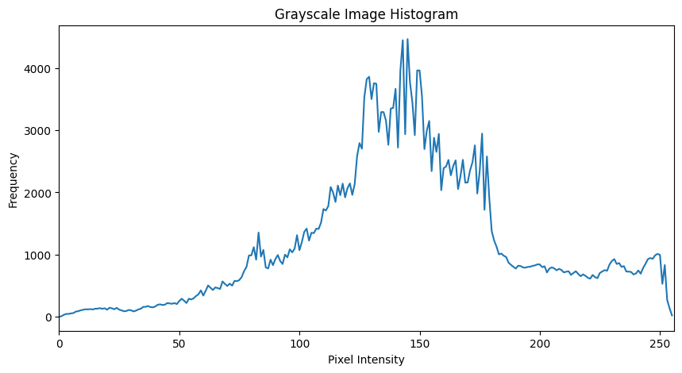
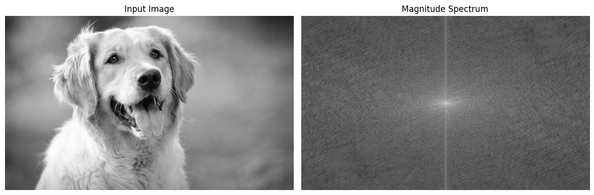
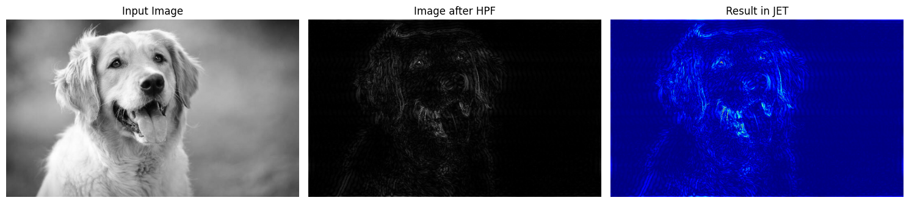

# 🖼️ Image Processing using Python & OpenCV

A practical image processing project using Python and OpenCV, covering fundamental image manipulation, image analysis, histogram processing, and frequency-domain techniques.

## 🔍 Overview

This project demonstrates core image processing operations including grayscale conversion, BGR channel analysis, image transformations, histogram analysis, Fourier Transform, Magnitude Spectrum, High-Pass Filtering, and intensity transformation.

## 🎯 Project Objective

To implement and understand fundamental image processing techniques using OpenCV, including spatial-domain transformations, histogram analysis, and frequency-domain processing.

The project aims to build practical understanding of image manipulation, analysis, filtering, and enhancement techniques.

## 🔗 Notebook

The complete implementation is available in the Jupyter Notebook:

`Image_Processing_OpenCV.ipynb`

## 🛠️ Technologies Used

- Python
- OpenCV
- NumPy
- Matplotlib
- Google Colab

## ⚙️ Key Features

- Image loading and visualization
- Image properties analysis
- Grayscale conversion
- BGR channel analysis
- Image resizing and cropping
- Image rotation and flipping
- Grayscale and BGR histogram analysis
- Fourier Transform and Magnitude Spectrum
- High-Pass Filtering with JET Colormap Visualization
- Negative image transformation
- Intensity transformatio

## 🔄 Workflow

```text
Input Image
    ↓
Image Analysis
    ↓
Grayscale & BGR Processing
    ↓
Resize / Crop / Rotate / Flip
    ↓
Histogram Analysis
    ↓
Fourier Transform
    ↓
Magnitude Spectrum
    ↓
High-Pass Filtering
    ↓
Negative & Intensity Transformation
    ↓
Processed Output
```

## 📁 Project Structure

```text
image-processing-opencv/
│
├── Image_Processing_OpenCV.ipynb
├── README.md
└── requirements.txt
```

## ▶️ How to Run

1. Open Image_Processing_OpenCV.ipynb in Google Colab.
2. Install the dependencies:
   pip install -r requirements.txt
3. Run the notebook cells sequentially.
   ```
## 📊 Results

The project generates visual outputs for image analysis and frequency-domain processing.

### Grayscale Histogram



### Fourier Magnitude Spectrum



### High-Pass Filtering




## 📦 Requirements

```text
opencv-python
numpy
matplotlib
```
## 🎓 Key Learning Outcomes

- Practical experience with OpenCV-based image processing
- Image manipulation and geometric transformations
- Histogram-based image analysis
- Frequency-domain processing using Fourier Transform
- High-Pass Filtering and image enhancement

## 👩‍💻 Author

**Kondam Sudeepthi**  
B.Tech CSE (AI & ML) Student
